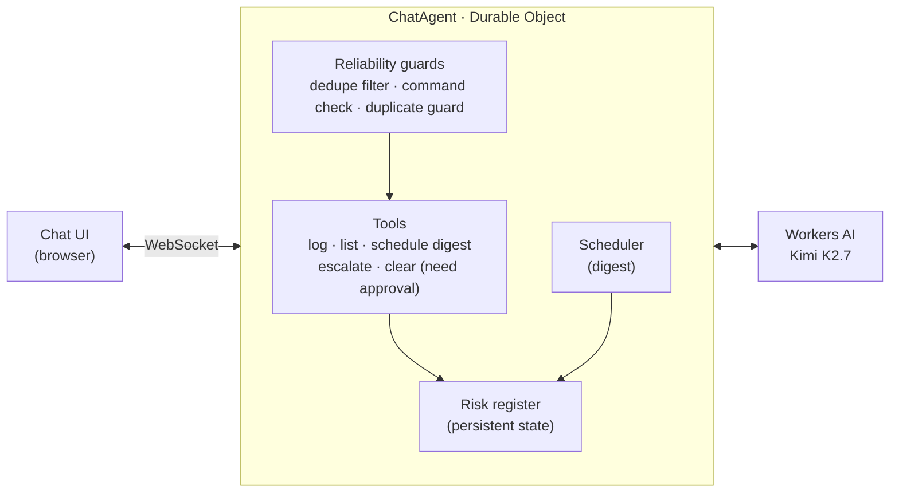

# Program Risk Copilot: Design Note

## Overview

Program Risk Copilot is a chat agent on Cloudflare that reads program and change status updates, scores delivery risk, and keeps a persistent risk register. It surfaces risk for a human to decide on; it never makes a go/no-go call itself.

The problem it targets is one I handled manually as a TPM: status updates arrive in free text, and the warning signs (a rushed review, skipped testing, a deploy right before a freeze) are easy to miss across many teams. The agent applies a consistent scoring framework to every update, modeled on the Change Score approach I used for release risk.

**Live app:** https://orange-grass-8b45.karthikeyan-arun9.workers.dev

Built from Cloudflare's agents-starter template, with the agent logic, tools, and reliability safeguards customized in [`src/server.ts`](src/server.ts).

## How it meets the requirements

All four required components are implemented and tested end to end on the deployed app.

| Requirement | Implementation | Where to see it |
| --- | --- | --- |
| LLM | Kimi K2.7 on Workers AI (`@cf/moonshotai/kimi-k2.7-code`), called through the Vercel AI SDK | Every reply; risk level, rationale and recommended action |
| Workflow / coordination | Durable Object agent (`AIChatAgent`) orchestrating six tools: log, list, escalate, clear, schedule digest, manage schedules. Escalate and clear require human approval | Ask to escalate a risk; an Approve/Reject prompt appears first |
| User input via chat | Chat UI from the starter template, connected to the agent over WebSockets | The app itself |
| Memory / state | Risk register stored in the agent's persistent state (`setState`), surviving restarts and reloads | Log updates, then ask "What risks are open?" |

The scheduled digest uses the Agents SDK scheduler: it runs later, reads open HIGH and NEEDS_HUMAN_REVIEW risks from state, and pushes a notification to the chat.

## Architecture

The browser talks to one Durable Object agent over a WebSocket. The agent sends each turn to Workers AI, runs the tools the model calls, and stores the register in its own persistent state. Every model response passes through the guards before any tool runs.

## Design decisions and trade-offs

**The model flags; a human decides.** The agent recommends an action but never approves or blocks a deploy. This matches how risk ownership works in practice: accountability stays with the program and engineering leads.

**Structured output through a tool, not free text.** The model records each assessment by calling `logRiskUpdate` with a fixed schema: team, summary, signals, risk level, rationale, recommended action. That makes every entry consistent and queryable, and lets code validate it.

**A defined scoring rubric.** Six named signals (short review window, incomplete testing, repeat incidents, risky timing, rushed language, missing rollback plan) and explicit rules: LOW for no meaningful signals, MEDIUM for one moderate or two minor, HIGH for a severe signal or three or more, NEEDS_HUMAN_REVIEW when the model is not confident.

**Human approval enforced in code.** `escalateRisk` and `clearRegister` are marked `needsApproval`, so the app shows an Approve/Reject prompt before they run, whatever the model says. The model also asks for confirmation in text, but that is courtesy; the code is the safeguard.

**Model choice: Kimi K2.7 instead of Llama 3.3.** I started on Llama 3.3 as the assignment suggests. In testing it repeatedly re-called tools from earlier turns and ignored tool results telling it to stop. Cloudflare's current agents-starter template uses Kimi K2.7, and it followed the tool rules reliably, so I switched. The safeguards below stay in place either way.

## Reliability issues found and fixed

Testing surfaced six problems. Each is fixed in code, so the app does not depend on the model behaving perfectly.

| Problem found | Root cause | Fix |
| --- | --- | --- |
| Every word and tool argument arrived twice ("TheThe risk risk"), breaking tool-call JSON | Workers AI streams each piece in two formats at once, and the connector (`workers-ai-provider`) passes both through. Confirmed by reading its source; affects Llama 3.3 and Kimi K2.7 | Stream middleware that drops the second copy of each piece and rebuilds tool arguments from the cleaned pieces. A repair step re-asks the model for clean JSON if arguments are still unreadable |
| The same update logged several times | The model re-read earlier messages and logged them again | Duplicate guard: same team and same signals within 10 minutes is not logged again |
| Signal names varied ("short review window" vs `short_review_window`) | Free-text model output | Code maps loose phrasing onto the six standard signal names |
| Old updates logged in response to commands ("Clear the register") | Model imitating earlier tool calls | Logging only writes when the latest message is a status update, not a command or question |
| Turn ended with only a tool card, no written reply | Model treated the tool call as the full answer | If a turn ends without text, the app writes a short reply from the tool results |
| `"true"` sent as text where a yes/no was expected | Loose model typing | Schema accepts both forms, without the common bug of treating `"false"` as true |

I also aligned package versions after an upgrade left the chat and agent libraries mismatched, which caused runtime errors.

## Test results

Three sample updates produced three different risk levels, each logged exactly once with the expected signals.

| Test input | Result | Signals |
| --- | --- | --- |
| Checkout: reviewed 30 minutes before deploy, regression testing skipped, going out before the holiday freeze | HIGH | short review window, incomplete testing, risky timing |
| Payments: reviewed by two engineers last week, full regression passed, rollback documented, Tuesday deploy | LOW | none |
| Search: push ASAP, testing done, no rollback plan yet | MEDIUM | rushed language, missing rollback plan |

The rest of the flow also passed:

- "What risks are open?" listed all three entries from state, with no stray logging.
- Escalating the Checkout risk showed an Approve/Reject prompt; after approval the entry was marked escalated, and the model drafted a leadership message with two options and their trade-offs.
- Clearing the register required approval the same way.
- A digest scheduled for 30 seconds later arrived as a notification. By design it lists only open HIGH and NEEDS_HUMAN_REVIEW risks, so already-escalated items drop out.
- Repeating an update already in the register was reported as a duplicate rather than logged again.

## Limitations and next steps

This is a working prototype; these are the main gaps before team use.

- **Escalation is simulated.** Escalating marks the risk and shows an in-app notification. A production version would post to Slack or email through an integration.
- **No authentication.** Anyone with the link uses the same agent and register. Next step: Cloudflare Access in front of the app, with one register per team.
- **The digest is one-off.** It runs once after a delay. A weekly recurring digest would use the scheduler's cron support.
- **Scoring depends on the model's judgment.** Signal names and logging are enforced in code, but the risk level is the model's call against the rubric. Next step: a small labeled set of past updates to measure scoring accuracy, and weighting signals in code.
- **Updates are typed in by hand.** Pulling status from Jira or ServiceNow would remove the manual step.
- **The connector bug is worked around, not fixed.** The doubled-streaming filter should be removed once `workers-ai-provider` is fixed upstream; it is worth reporting there.
